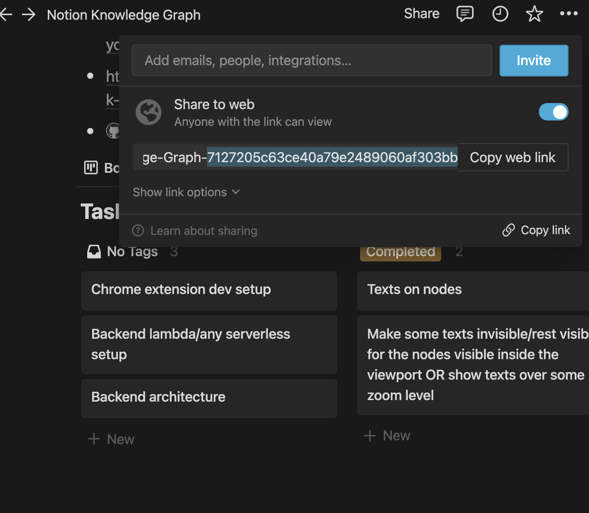

# notion


```bash
npm i --save @graphcentral/notion-graph-scraper
```

You will be able to visualize the output from @graphcentral/notion-graph-scraper with [@graphcentral/graph](https://github.com/graphcentral/graph) like below:


## Example

First, get a public Notion page (if you just want to test it out), preferably with some sub-pages inside it, so that you can get a graph with some nodes. You can also request private pages if you create your own instance of `NotionAPI` from `notion-client`. The example below is only for public pages.

Then, get the id of the page like below:



Then, input the id of the page as a parameter to `notionGraph.buildGraphFromRootNode`

```ts
import { NotionGraph } from "@graphcentral/notion-graph-scraper"
import fs from "fs"
/**
 * example of how to use `@graphcentral/notion-graph-scraper`
 */
;(async () => {
  const notionGraph = new NotionGraph({
    maxDiscoverableNodes: 2000,
    maxDiscoverableNodesInOtherSpaces: 2000,
    verbose: true,
  })
  const graph = await notionGraph.buildGraphFromRootNode(
    // Some random Japanese blog
    `95fcfe03257541c5aaa21dd43bdbc381`
  )
  console.log(graph.nodes.length)
  console.log(graph.links.length)
  await new Promise((resolve, reject) => {
    fs.writeFile(`test0.json`, JSON.stringify(graph), (err) => {
      if (err) reject(err)
      else resolve(``)
    })
  });

  process.exit(0)
})()
```

The graph will be an object of this type:

```ts
{
  nodes: Node[]
  links: Link[]
  errors: Error[]
}
```

Then, you can directly use this as an input to [@graphcentral/graph](https://github.com/graphcentral/graph) to visualize it on the web as a force layout graph.

## Example setup

An example setup is at [@graphcentral/notion-scrape-example](https://github.com/graphcentral/notion-scrape-example).

## Use ES6 module instead of Commonjs

This project uses es6 module (.mjs). Therefore, the following setup is needed:

In your `package.json`, specify "type" as "module"
```json
{
  ...
  "type": "module",
  ...
}
```

Then, using the latest version of node (this project uses whatever is specified in `.nvmrc` which is as of now `v16.15.1`), just run `node index.js` where `index.js` contains the previous example code.

