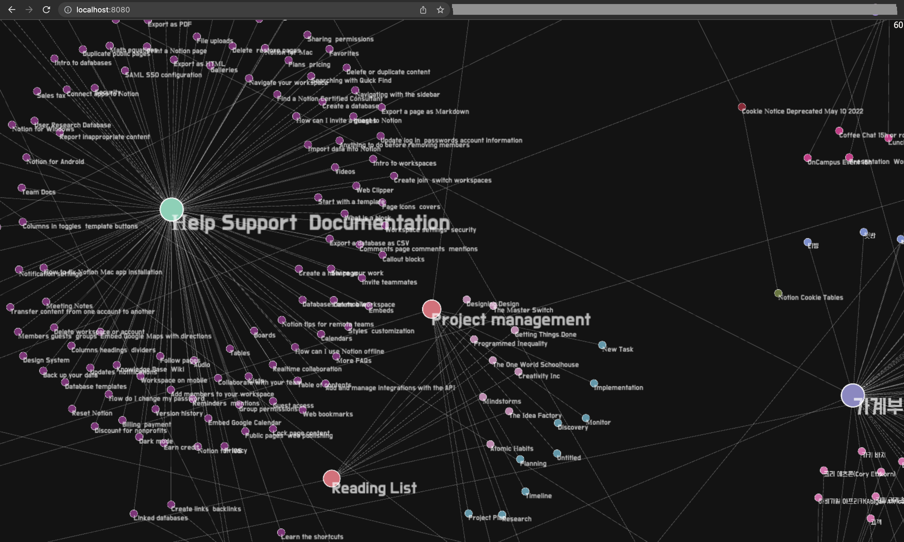

# notion


```bash
npm i --save @graphcentral/notion-graph-scraper
```

# `@graphcentral/notion-graph-scraper`

Scrapes all Notion pages given a root page. For the graphing library itself, visit [graphcentral/graph](https://github.com/graphcentral/graph).

## Example

First, get a public Notion page (if you just want to test it out), preferably with some sub-pages inside it, so that you can get a graph with some nodes. You can also request private pages if you create your own instance of `NotionAPI` from `notion-client`. The example below is only for public pages.

Then, get the id of the page like below:


Then, input the id of the page as a parameter to `notionGraph.buildGraphFromRootNode`

```ts
import { NotionGraph } from "@graphcentral/notion-graph-scraper"
import fs from "fs"
/**
 * example of how to use `@graphcentral/notion-graph-scraper`
 */
;(async () => {
  const notionGraph = new NotionGraph({
    maxDiscoverableNodes: 2000,
    maxDiscoverableNodesInOtherSpaces: 2000,
    verbose: true,
  })
  const graph = await notionGraph.buildGraphFromRootNode(
    // notion help page
    `e040febf70a94950b8620e6f00005004`
  )
  console.log(graph.nodes.length)
  console.log(graph.links.length)
  await new Promise((resolve, reject) => {
    fs.writeFile(`test0.json`, JSON.stringify(graph), (err) => {
      if (err) reject(err)
      else resolve(``)
    })
  });

  process.exit(0)
})()
```

The graph will be an object of this type:

```ts
{
  nodes: Node[]
  links: Link[]
  errors: Error[]
}
```

Then, you can directly use this as an input to [@graphcentral/graph](https://github.com/graphcentral/graph) to visualize it on the web as a force layout graph, like below:

